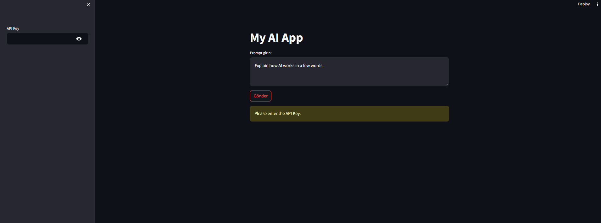
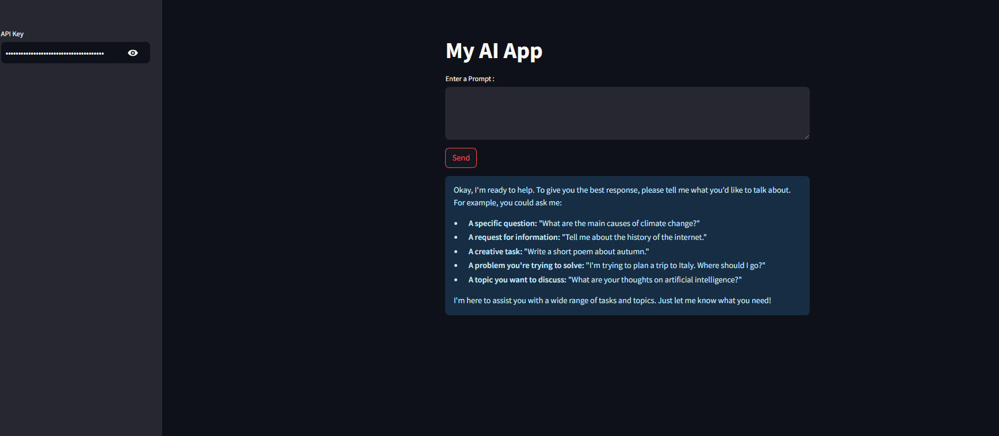
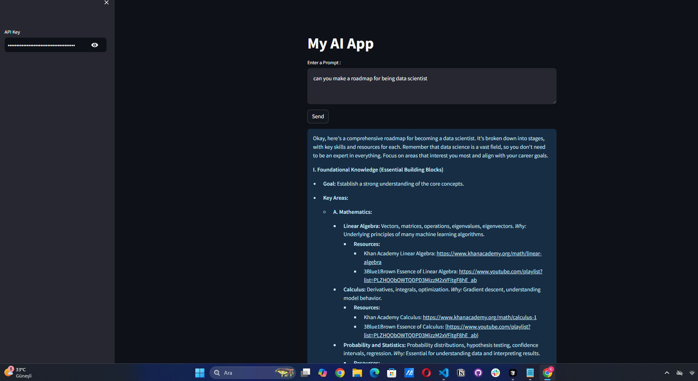
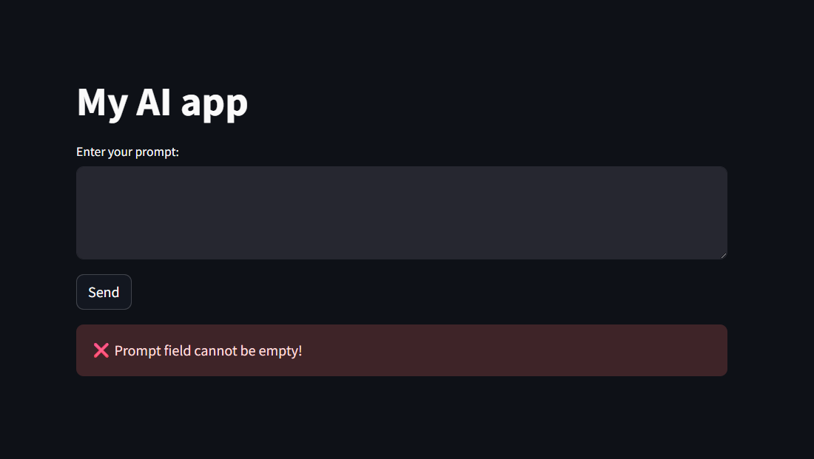
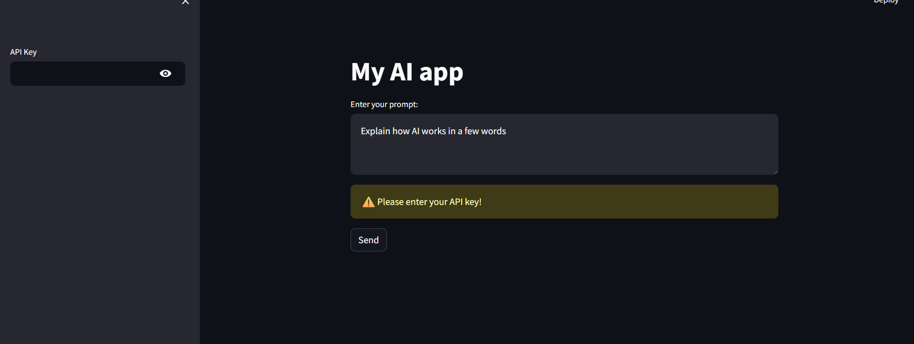

# 🤖 AI Assistant App

This project is an interactive AI assistant application developed using **LangChain** and **Streamlit**. It allows users to ask questions, get contextual responses, and explore roadmap suggestions—all powered by large language models.

---

## 🚀 Features

- 🧠 Natural language understanding
- 🔗 LangChain integration for prompt chaining
- 🌐 Streamlit UI for real-time user interaction
- 🧩 Error handling for empty prompts and API key validation

---

## 📸 Screenshots

### 1. Main Page


### 2. Empty Prompt
When the user submits an empty prompt without any question.


### 3. Ask Roadmap or Question
An example interaction asking for a learning roadmap.


### 4. Empty Prompt Error
Validation error when the prompt field is empty.


### 5. Missing API Key
Displayed when API key is not provided.


---

## 🛠️ Tech Stack

- [LangChain](https://www.langchain.com/)
- [Streamlit](https://streamlit.io/)
- Python 3.10+

---

## 💡 How to Run

```bash
pip install -r requirements.txt
streamlit run app.py
